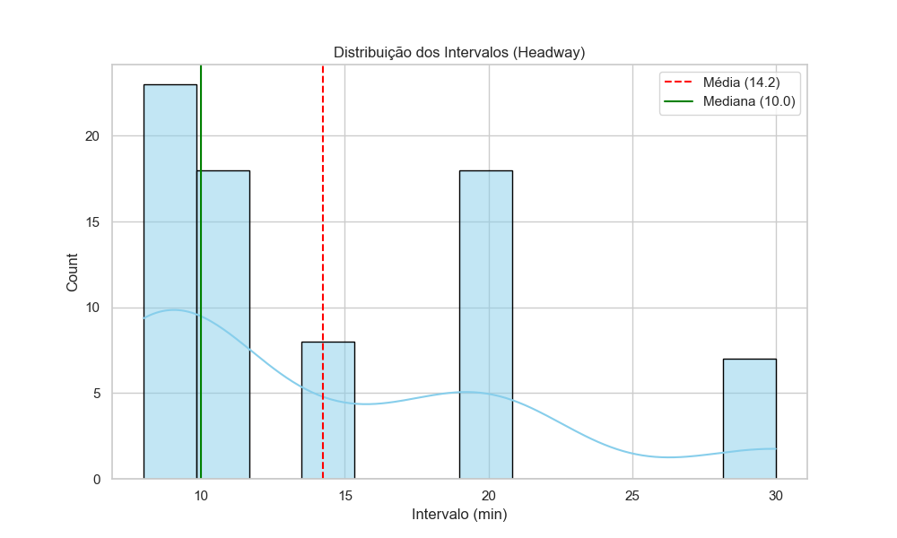
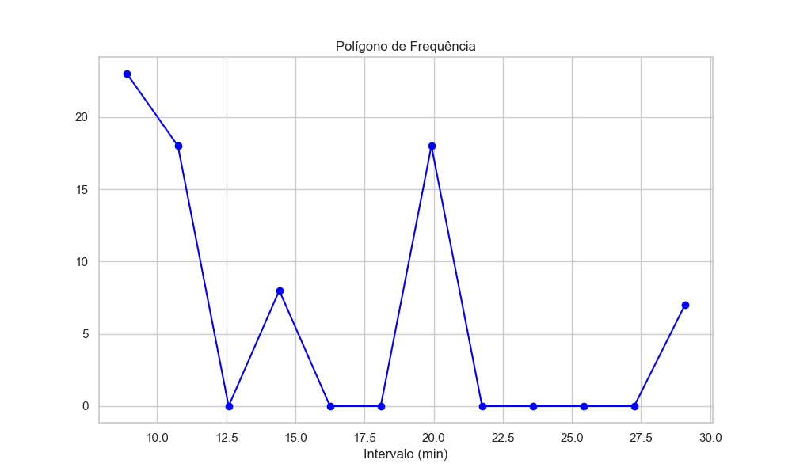
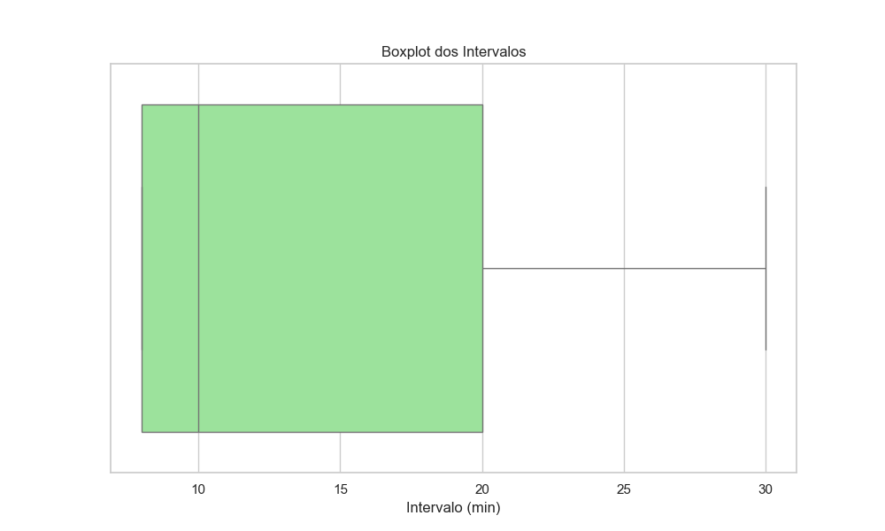

# Análise Estatística e Probabilística: Regularidade da Linha 211 (Vitória/ES)

**Disciplina:** Probabilidade e Estatística – Engenharias  
**Professor:** Guilbert de Arruda Souza  
**Entrega:** 04/12

---

## 1. Introdução

Este projeto consiste na aplicação prática dos conceitos de Probabilidade e Estatística (Unidades I a VI) para analisar a confiabilidade operacional do transporte público de Vitória/ES. O objeto de estudo é a **Linha 211 (Santo André / Jardim Camburi)**, uma rota estratégica que conecta regiões residenciais à UFES e áreas comerciais.

O foco da análise é a variável **Headway** (Intervalo entre Partidas). Na Engenharia de Transportes, a regularidade é um indicador crítico de qualidade; um sistema com alta variância nos intervalos gera incerteza e perda de produtividade para o usuário.

- **Objetivo:** Quantificar a variabilidade dos tempos de espera, modelar o comportamento probabilístico da linha e inferir intervalos de confiança para a média real de operação.
- **Origem dos Dados:** Os dados foram simulados computacionalmente (Python) baseando-se nos padrões de oferta (picos e vales) disponíveis na API do portal Dados Abertos de Vitória, refletindo um dia útil típico com 74 viagens.

---

## 2. Organização e Apresentação dos Dados (Unidade I)

A amostra consiste em n = 74 observações de intervalos de tempo. Para a organização dos dados, foi construída uma **Tabela de Distribuição de Frequências** (gerada via script), dividindo os dados em classes para análise gráfica.

### Visualização Gráfica

A análise visual do comportamento dos dados foi realizada através de três ferramentas principais:

1.  **Histograma:** Para visualizar a densidade e a forma da distribuição.
2.  **Polígono de Frequência:** Para observar os picos de ocorrência.
3.  **Ogiva (Frequência Acumulada):** Para analisar o acúmulo percentual dos intervalos.

|                Histograma                 |        Polígono de Frequência         |
| :---------------------------------------: | :-----------------------------------: |
|  |  |

> _Figura 1 e 2: O Histograma e o Polígono mostram uma distribuição assimétrica positiva (cauda à direita), indicando que, embora a maioria dos intervalos seja curto (pico), há ocorrências frequentes de intervalos longos (atrasos)._

---

## 3. Medidas de Posição (Unidade II)

Para caracterizar a tendência central da operação, foram calculadas as seguintes métricas:

| Medida      | Valor Calculado | Interpretação                                           |
| :---------- | :-------------- | :------------------------------------------------------ |
| **Média**   | **14,26 min**   | Tempo médio de espera esperado pelo usuário.            |
| **Mediana** | **12,18 min**   | 50% dos intervalos são menores que este valor.          |
| **Moda**    | **10,00 min**   | O intervalo mais frequente (típico de horário de pico). |

### Separatrizes (Quartis e Decis)

A análise de separatrizes permite entender os extremos da operação:

- **1º Quartil (Q1):** 8,72 min (25% dos intervalos são rápidos).
- **3º Quartil (Q3):** 19,24 min (75% dos intervalos são inferiores a este valor).
- **1º Decil (D1):** 5,85 min (10% das viagens ocorrem em sucessão muito rápida).
- **9º Decil (D9):** 23,54 min (10% dos usuários enfrentam esperas superiores a 23 min).


_(Figura 3: O Boxplot evidencia a assimetria e aponta a existência de possíveis outliers nos intervalos superiores)._

---

## 4. Medidas de Dispersão e Forma (Unidade III)

Esta seção avalia a **regularidade** do serviço, o ponto mais crítico para a Engenharia de Tráfego.

- **Amplitude Total:** 31,05 min.
- **Variância (s²):** 55,95 min².
- **Desvio Padrão (s):** 7,48 min.
- **Desvio Médio Absoluto:** 5,90 min.
- **Coeficiente de Variação (CV):** **52,43%**.

### Análise de Forma e Escore Z

- **Assimetria:** 0,70 (Positiva). A cauda da distribuição se estende para os valores maiores (atrasos).
- **Escore Z Máximo:** O maior intervalo registrado no dia (35,8 min) possui um Z = 2,88. Isso significa que este atraso está a quase 3 desvios padrões acima da média, sendo um evento estatisticamente raro (extremo).

> **Conclusão da Unidade:** O CV > 50% indica uma amostra **heterogênea**. O serviço é instável, dificultando o planejamento do usuário.

---

## 5. Probabilidade (Unidade IV)

- **Espaço Amostral:** Tempo contínuo (t > 0).
- **Eventos de Interesse:** Esperas excessivas e comportamento em horários de pico.

### Probabilidade Condicional

Calculou-se a probabilidade de um usuário ser atendido rapidamente (menos de 10 min) **dado que** ele está no horário de Pico da Tarde (16h - 19h).

P(Intervalo < 10 | Pico Tarde) ≈ 60,87%

_Interpretação:_ Se o passageiro chegar no ponto no horário de pico, ele tem aproximadamente 61% de chance de esperar menos de 10 minutos, o que comprova a alocação de frota nestes horários, apesar da variabilidade global.

---

## 6. Variáveis Aleatórias (Unidade V)

A variável "Headway" é modelada como uma **Variável Aleatória Contínua**. Pela Teoria do Limite Central e formato do histograma, aproximou-se o comportamento por uma **Distribuição Normal** com média = 14,26 e desvio padrão = 7,48.

### Cálculo de Probabilidade (Modelo Normal)

Qual a probabilidade de um intervalo qualquer superar 25 minutos?

P(X > 25) = 1 - P(Z ≤ 1,43)

Resultado teórico: **7,55%**.
_Na prática, isso significa que a cada 13 ônibus, 1 terá um intervalo excessivamente longo._

---

## 7. Amostragem e Estimação (Unidade VI)

Considerando os dados coletados como uma Amostra Aleatória Simples (n=74) de um mês de operação.

### Intervalo de Confiança (IC) para a Média

Com 95% de confiança, estima-se que a verdadeira média de espera da linha 211 esteja entre:

IC (95%) = [12,56 min ; 15,97 min]

### Dimensionamento de Amostra

A margem de erro atual é de aproximadamente 1,7 min. Para aumentar a precisão da pesquisa e obter uma **margem de erro de apenas 1,0 minuto** (com 95% de confiança), calculou-se o tamanho de amostra necessário:

n ≈ 215 observações

Seria necessário quase triplicar a coleta de dados para atingir essa precisão refinada.

---

## 8. Conclusão

A análise estatística completa da Linha 211 revela um sistema operacionalmente funcional, mas com **baixa confiabilidade (CV > 50%)**.

1.  **Diagnóstico:** A média de 14 minutos é aceitável, mas o alto desvio padrão penaliza o usuário. O problema principal não é a falta de veículos, mas a irregularidade (comboios seguidos de longos "buracos").
2.  **Comparativo:** Como usuário de bicicleta (10km em 20 min com variância quase nula), nota-se que o transporte público perde competitividade devido à incerteza, não apenas ao tempo médio.
3.  **Sugestão de Engenharia:** A implementação de medidas de _Headway Control_ (regulação de terminais) é prioritária para reduzir a dispersão, visando um desvio padrão abaixo de 3 minutos.

---

## 9. Referências e Ferramentas

- **Linguagem:** Python 3.10
- **Bibliotecas:** `pandas`, `numpy`, `scipy.stats`, `seaborn`, `matplotlib`.
- **Fonte de Dados:** Simulação estocástica baseada em parâmetros da API do Portal de Dados Abertos de Vitória.
- **Referencial Teórico:** Material de aula da disciplina de Probabilidade e Estatística - Engenharias.

### Como reproduzir esta análise

```bash
# Instalar dependências
pip install pandas numpy matplotlib seaborn scipy

# Executar a análise
python trabalho_estatistica.py
```
